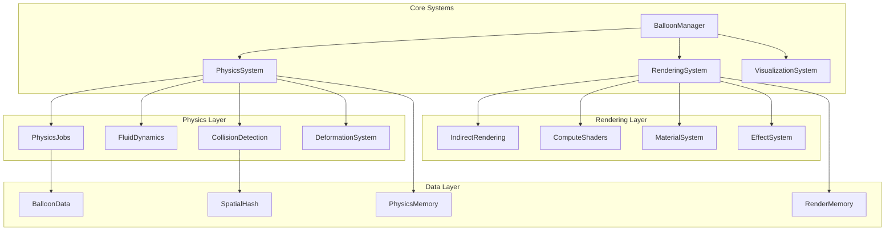

# 風船シミュレーション強化 - 設計書

## 概要

本設計書は、既存のUnity Job SystemとIndirect Renderingベースの風船物理シミュレーションを、パーティクルシステムとしての視覚的品質とリアルな物理挙動を追求した高度なシステムに発展させるための包括的な設計を定義します。

現在のシステムは1000個の風船を効率的に処理できる優れた基盤を持っていますが、以下の領域で大幅な強化を行います：

- **視覚的品質**: 物理ベースレンダリング、高品質シェーダー、リアルタイム変形
- **物理シミュレーション**: 流体力学、群集効果、高精度計算
- **パフォーマンス**: 50000個以上の風船を60FPS以上で処理
- **スケーラビリティ**: モジュラー設計による拡張性

## アーキテクチャ

### システム全体構成



### レイヤー構造

1. **管理層 (Management Layer)**
   - システム全体の調整と制御
   - パフォーマンス監視と最適化
   - リソース管理

2. **物理層 (Physics Layer)**
   - 高精度物理計算
   - 流体力学シミュレーション
   - 変形・破裂処理

3. **レンダリング層 (Rendering Layer)**
   - GPU最適化レンダリング
   - 視覚エフェクト
   - シェーダー管理

4. **データ層 (Data Layer)**
   - メモリ効率的なデータ構造
   - 空間分割
   - キャッシュ最適化

## コンポーネントとインターフェース

### 1. 強化されたBalloonManager

```csharp
public class EnhancedBalloonManager : MonoBehaviour
{
    // システム管理
    private PhysicsSystemManager physicsSystem;
    private RenderingSystemManager renderingSystem;
    private VisualizationSystemManager visualizationSystem;
    private PerformanceManager performanceManager;
    
    // 設定
    [SerializeField] private BalloonSimulationConfig config;
    [SerializeField] private int maxBalloonCount = 50000;
    
    // パフォーマンス監視
    private PerformanceProfiler profiler;
    private AdaptiveLODSystem lodSystem;
}
```

### 2. 高度な物理システム

```csharp
public class PhysicsSystemManager
{
    // Job System統合
    private NativeArray<EnhancedBalloonData> balloonData;
    private FluidDynamicsSystem fluidSystem;
    private DeformationSystem deformationSystem;
    private CollisionSystemV2 collisionSystem;
    
    // 物理計算Jobs
    private JobHandle physicsJobHandle;
    private JobHandle fluidJobHandle;
    private JobHandle deformationJobHandle;
}

[BurstCompile]
public struct EnhancedPhysicsJob : IJobParallelFor
{
    // 流体力学計算
    // 表面張力
    // 粘性効果
    // 温度効果
}
```

### 3. 次世代レンダリングシステム

```csharp
public class RenderingSystemManager
{
    // GPU Compute統合
    private ComputeBuffer transformBuffer;
    private ComputeBuffer deformationBuffer;
    private ComputeBuffer materialPropertyBuffer;
    
    // シェーダー管理
    private MaterialPropertyBlock propertyBlock;
    private ComputeShader deformationCompute;
    private ComputeShader lightingCompute;
    
    // エフェクトシステム
    private ParticleEffectManager effectManager;
    private FluidVisualizationSystem fluidViz;
}
```

### 4. データモデル強化

```csharp
[System.Serializable]
public struct EnhancedBalloonData
{
    // 基本物理データ
    public float3 position;
    public float3 velocity;
    public float3 acceleration;
    public quaternion rotation;
    public float3 angularVelocity;
    
    // 形状・材質データ
    public float radius;
    public float mass;
    public float buoyancy;
    public float elasticity;
    public float viscosity;
    
    // 変形データ
    public float4x4 deformationMatrix;
    public float surfaceTension;
    public float internalPressure;
    
    // 視覚データ
    public float4 baseColor;
    public float metallic;
    public float roughness;
    public float transparency;
    public float4x4 transformMatrix;
    
    // 状態データ
    public BalloonState state;
    public float health;
    public float age;
}

public enum BalloonState
{
    Normal,
    Deforming,
    Bursting,
    Destroyed
}
```

## データモデル

### 空間分割システム強化

```csharp
public struct HierarchicalSpatialGrid
{
    // マルチレベル空間分割
    public NativeArray<SpatialCell> level0Cells; // 粗い分割
    public NativeArray<SpatialCell> level1Cells; // 中間分割
    public NativeArray<SpatialCell> level2Cells; // 細かい分割
    
    // 動的セルサイズ調整
    public float baseCellSize;
    public float densityThreshold;
    public int maxObjectsPerCell;
}

public struct FluidGrid
{
    // 流体計算用グリッド
    public NativeArray<float3> velocityField;
    public NativeArray<float> pressureField;
    public NativeArray<float> densityField;
    public NativeArray<float> temperatureField;
}
```

### メモリプール管理

```csharp
public class BalloonMemoryManager
{
    // オブジェクトプール
    private NativePool<EnhancedBalloonData> balloonPool;
    private NativePool<CollisionPair> collisionPool;
    private NativePool<DeformationData> deformationPool;
    
    // メモリ最適化
    private MemoryProfiler memoryProfiler;
    private GarbageCollectionMinimizer gcMinimizer;
}
```

## エラーハンドリング

### 物理計算安定性

```csharp
public class PhysicsStabilityManager
{
    // 数値安定性チェック
    public bool ValidatePhysicsState(ref EnhancedBalloonData balloon);
    
    // エラー回復
    public void RecoverFromInstability(ref NativeArray<EnhancedBalloonData> balloons);
    
    // 制約強制
    public void EnforceConstraints(ref EnhancedBalloonData balloon);
}
```

### パフォーマンス保護

```csharp
public class PerformanceGuard
{
    // フレームレート監視
    private float targetFrameRate = 60f;
    private float minFrameRate = 30f;
    
    // 自動品質調整
    public void AdjustQualitySettings();
    
    // 緊急時処理
    public void EmergencyPerformanceMode();
}
```

### リソース管理

```csharp
public class ResourceManager
{
    // メモリ使用量監視
    private long maxMemoryUsage;
    private long currentMemoryUsage;
    
    // リソース解放
    public void CleanupUnusedResources();
    
    // メモリリーク検出
    public void DetectMemoryLeaks();
}
```

## テスト戦略

### 単体テスト

```csharp
[TestFixture]
public class PhysicsSystemTests
{
    [Test]
    public void TestBuoyancyCalculation();
    
    [Test]
    public void TestCollisionResponse();
    
    [Test]
    public void TestFluidDynamics();
    
    [Test]
    public void TestDeformationSystem();
}

[TestFixture]
public class RenderingSystemTests
{
    [Test]
    public void TestIndirectRendering();
    
    [Test]
    public void TestShaderCompilation();
    
    [Test]
    public void TestMaterialSystem();
}
```

### パフォーマンステスト

```csharp
[TestFixture]
public class PerformanceTests
{
    [Test]
    public void TestScalability_1000Balloons();
    
    [Test]
    public void TestScalability_10000Balloons();
    
    [Test]
    public void TestScalability_50000Balloons();
    
    [Test]
    public void TestMemoryUsage();
    
    [Test]
    public void TestFrameRateStability();
}
```

### 統合テスト

```csharp
[TestFixture]
public class IntegrationTests
{
    [Test]
    public void TestFullSimulationCycle();
    
    [Test]
    public void TestSystemInteractions();
    
    [Test]
    public void TestErrorRecovery();
}
```

## 実装詳細

### フェーズ1: 基盤強化
- EnhancedBalloonDataの実装
- 強化されたJob Systemの構築
- 基本的な変形システム

### フェーズ2: 視覚品質向上
- 物理ベースシェーダー
- リアルタイム変形
- 高品質エフェクト

### フェーズ3: 物理シミュレーション高度化
- 流体力学システム
- 群集効果
- 環境相互作用

### フェーズ4: パフォーマンス最適化
- 50000個対応
- GPU Compute活用
- メモリ最適化

### フェーズ5: 可視化・分析機能
- 流体可視化
- データ分析
- デバッグツール

## 技術的考慮事項

### Unity Job System最適化
- Burst Compilerの最大活用
- メモリアライメント最適化
- キャッシュ効率の向上

### GPU Compute活用
- 物理計算のGPU移行
- レンダリングとの並列処理
- メモリ転送最小化

### スケーラビリティ設計
- 動的品質調整
- 階層的LODシステム
- 適応的リソース管理

この設計により、現在の1000個から50000個以上の風船を美しく、リアルに、高性能で処理できるシステムを構築します。